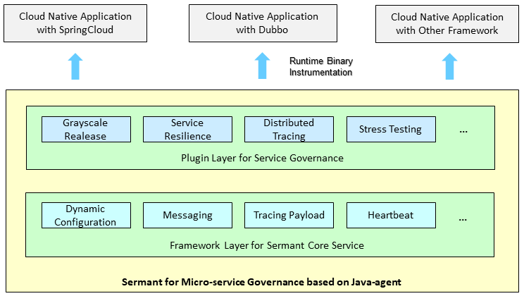
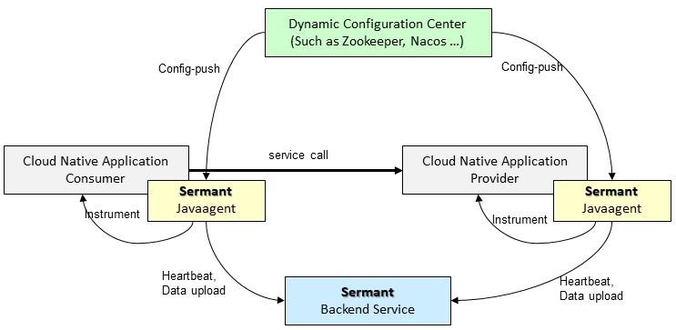
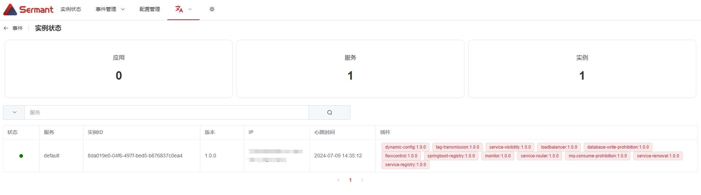

<div align="center">
<p></p><p></p>
<p>
    
</p>
<h1>基于JavaAgent的无代理服务网格解决方案</h1>


[简体中文](README-zh.md) | [English](README.md)

[](https://landscape.cncf.io/?item=orchestration-management--service-mesh--sermant)
[](https://www.apache.org/licenses/LICENSE-2.0.html)
[](https://github.com/sermant-io/Sermant/actions?query=workflow:CI:push%20branch:develop)
[](https://codecov.io/gh/sermant-io/Sermant)

</div>

## Sermant

**Sermant**（也称之为Java-mesh）是基于Java字节码增强技术的无代理服务网格，其利用Java字节码增强技术为宿主应用程序提供服务治理功能，以解决大规模微服务体系结构中的服务治理问题。

Sermant的愿景还包括构建插件开发生态系统，以帮助开发人员更容易地开发服务治理功能，同时不干扰业务代码。


Sermant是云原生计算基金会（CNCF）的沙盒项目。如果您是一个希望在支持云原生生态系统的增长和发展方面发挥积极作用的组织，请考虑加入CNCF。



Sermant架构描述如上，Sermant中JavaAgent包含两层功能。

- 框架核心层。核心层提供Sermant的基本框架功能，以简化插件开发。该层的功能包括心跳、数据传输、动态配置等。
- 插件服务层。插件为宿主应用提供实际的治理服务。开发者可以直接利用框架核心服务开发简单插件，也可以开发插件自身的复杂服务治理功能来开发复杂插件。

Sermant中的JavaAgent广泛采用类隔离技术，以消除框架代码、插件代码和宿主应用程序代码之间的类加载冲突。

使用Sermant的微服务架构具有以下三个组件，如下图所示。



- Sermant JavaAgent：动态地为宿主应用程序提供服务治理能力。
- Sermant Backend：为JavaAgent的上传数据提供连接和预处理服务。
- Dynamic configuration center：通过动态更新监听的JavaAgent的配置来提供指令。Sermant项目不直接提供动态配置中心。这些项目目前支持servicecomb-kie等。

## 快速开始

下面是一个简单的演示，新用户只需4个步骤即可使用Sermant

### 准备工作

- [下载](https://github.com/sermant-io/Sermant/releases/download/v2.0.0/sermant-2.0.0.tar.gz) Sermant Release包（当前版本推荐2.0.0）
- [下载](https://github.com/sermant-io/Sermant-examples/releases/download/v2.0.0/sermant-examples-flowcontrol-demo-2.0.0.tar.gz) Demo二进制产物压缩包
- [下载](https://zookeeper.apache.org/releases#download) 并启动zookeeper

### 获取Demo二进制产物
解压Demo二进制产物压缩包，即可得到spring-provider.jar。

### 修改Sermant配置

修改`${path}/sermant-agent-x.x.x/agent/config/config.properties`文件中`agent.service.heartbeat.enable`和`agent.service.gateway.enable`配置为true，以此来开启Sermant的心跳服务和网关服务，如下所示：

```properties
agent.service.heartbeat.enable=true
agent.service.gateway.enable=true
```

> 说明：path为Sermant包下载所在路径

### 启动Sermant Backend

在`${path}/sermant-agent-x.x.x/server/sermant`目录执行以下命令：

```shell
java -jar sermant-backend-x.x.x.jar
```

> 说明：path为Sermant包下载所在路径

### 启动Demo应用

在spring-provider.jar文件所在目录下执行以下命令：

```shell
# linux mac
java -javaagent:${path}/sermant-agent-x.x.x/agent/sermant-agent.jar -jar spring-provider.jar

# windows
java -javaagent:${path}\sermant-agent-x.x.x\agent\sermant-agent.jar -jar spring-provider.jar
```

> 说明：path为Sermant包下载所在路径

### 验证

打开浏览器并导航到URL`http://localhost:8900`，如下图所示：




## License

Sermant 采用 [Apache 2.0 License.](/LICENSE)

## 贡献指南

请阅读 [贡献指南](CONTRIBUTING.md) 以了解如何贡献项目。

## 会议
[Sermant社区兴趣讨论会会议纪要](https://docs.google.com/document/d/11Ln1MzOil0JjkM8SEeaJPukumIFyM_eG_u9WMQyke4c/edit)

## 更多文档

[Sermant官网](https://sermant.io) | [RoadMap](RoadMap.md) | [Membership](community-membership.md)

## 联系我们

* [邮件列表](https://groups.google.com/forum/#!forum/sermant)
* [Slack](https://cloud-native.slack.com/archives/C06VDFQUA7N) | [Join](https://slack.cncf.io/)
* 微信交流群：请先申请Sermant小二为好友，通过后会拉您进群，申请时请备注公司+职务。


