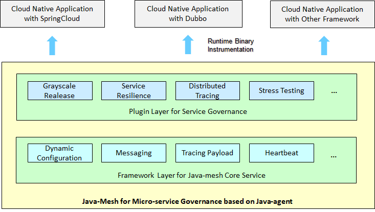
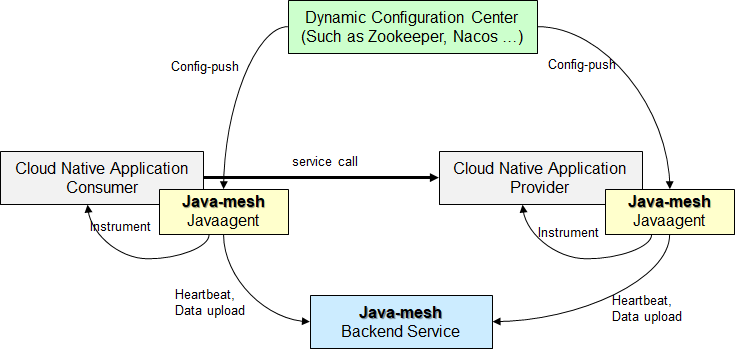

### A service mesh solution based on JavaAgent
[](https://gitter.im/JavaMeshUsers/community?utm_source=badge&utm_medium=badge&utm_campaign=pr-badge)
[](https://www.apache.org/licenses/LICENSE-2.0.html)
[](https://github.com/huaweicloud/java-mesh/actions?query=workflow:Java%20CI%20with%20Maven%20event:push%20branch:develop)
## What is Java-mesh

**Java-mesh** is a service mesh technology based on JavaAgent . It leverages the [JavaAgent](https://docs.oracle.com/javase/8/docs/api/java/lang/instrument/package-summary.html) to instrument the host application with enhanced service governance function, in order to solve the service governance problem, in the massive micro-service architecture.

Java-mesh's purpose also includes building a plugin-development ecosystem to help developers develop the service governance function more easily while not interfering the business code. The Java-mesh architecture is depicted as follows.



As described above, Java-mesh's Javaagent has two layers of functions.

- Framework core layer. The core layer provides Java-mesh's basic framework capability, in order to ease the plugin development. The function of this layer includes heart beat, data transmit, dynamic configuration, etc.
- Plugin service layer. The plugin provides actual governance service for the application. The developer can either develop simple plugin by directly leveraging framework core service, or can develop complex plugin by developing plugin's own complex service-governance function.

Java-mesh's Javaagent widely adopts class isolation technology in order to eliminate the class load conflicts between framework code, plugin code, and application code.

A microservice architecture using Java-mesh has the following has the following three components, which is depicted in the following diagram.



- Java-mesh Javaagent: dynamically instrument the application for the service governance capability.
- Java-mesh Backend：provide the connection and the pre-processing service for the Javaagents' all uploaded-data.
- Dynamic configuration center：Providing the instructions by dynamically update the config to the listening Javaagent. Dynamic configuration center is not directly provided by Java-mesh project. The projects currently support servicecomb-kie, etc.


## Quick start

### Download or compile

Click [here](https://github.com/huaweicloud/java-mesh/releases) to download **JavaMesh** binary package. If you will to compile the project yourself, please follow the following steps.

Execute *maven* command to package the **Java-mesh** project's [demo module](javamesh-samples/javamesh-example).

```shell
mvn clean package -Dmaven.test.skip -Pexample
```

Execute *maven* command to package the **Java-mesh** project's [back-end module](javamesh-samples/javamesh-backend).

```shell
mvn clean package -Dmaven.test.skip -Pbackend
```

### Start Java-mesh

Start **Java-mesh** backend

```shell
# Run under Linux
java -jar javamesh-agent-x.x.x/server/javamesh/javamesh-backend-x.x.x.jar
```

```shell
# Run under Windows
java -jar javamesh-agent-x.x.x\server\javamesh\javamesh-backend-x.x.x.jar
```

Start **Java-mesh** demo project：

```shell
# Run under Linux
java -cp javamesh-samples/javamesh-example/demo-application/target/demo-application.jar \
  -javaagent:javamesh-agent-x.x.x/agent/javamesh-agent.jar=appName=test \
  com.huawei.example.demo.DemoApplication
```

```shell
# Windows下执行
java -cp ..\javamesh-samples\javamesh-example\demo-application\target\demo-application.jar ^
  -javaagent:javamesh-agent-x.x.x\agent\javamesh-agent.jar=appName=test ^
  com.huawei.example.demo.DemoApplication
```


## More documents to follow

Please refer to the  [Development Guide](docs/README.md)

## License

Java-mesh adopts [Apache 2.0 License.](/LICENSE)


## How to contribute

Please read  [Contribute Guide](CONTRIBUTING.md) to refer how to jion the contribution.

## Declaration

- [Apache/Servicecomb-java-chassis](https://github.com/apache/servicecomb-java-chassis): Java-mesh refer the service governance algorithm from Apache Servicecomb project.
- [Apache/Servicecomb-kie](https://github.com/apache/servicecomb-kie): Java-mesh uses servicecomb-kie as the default dynamic configuration center.
- [Apache/SkyWalking](https://skywalking.apache.org/): The plugin architecture in this project is refered to Apache Skywalking. Part of the framework code in Java-mesh is built based on Apache Skywalking project as well.
- [Alibaba/Sentinel](https://github.com/alibaba/Sentinel): Java-mesh's flow-control plugin is built based on Alibaba Sentinel project. 

