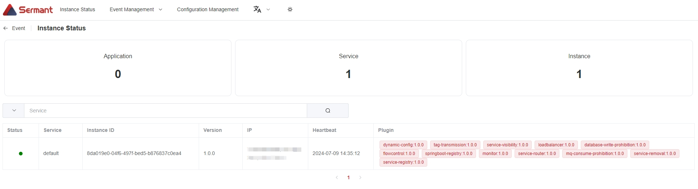

<div align="center">
<p></p><p></p>
<p>
    
</p>
<h1>A Proxyless Service Mesh Based on Bytecode Enhancement</h1>


[简体中文](README-zh.md) | [English](README.md)

[](https://landscape.cncf.io/?item=orchestration-management--service-mesh--sermant)
[](https://www.apache.org/licenses/LICENSE-2.0.html)
[](https://github.com/sermant-io/Sermant/actions?query=workflow:CI:push%20branch:develop)
[](https://codecov.io/gh/sermant-io/Sermant)
</div>

## What is Sermant?

**Sermant** (also known as Java-mesh) is a proxyless service mesh based on Java bytecode enhancement technology. It utilizes Java bytecode enhancement to provide service governance capabilities to applications, addressing service governance issues in large-scale microservices architectures. 

Sermant's vision also includes building a plugin development ecosystem to assist developers in more easily creating service governance functionalities without interfering with the application's source code.


Sermant is a sandbox project of the Cloud Native Computing Foundation (CNCF). Please consider joining the CNCF if you are an organization that wants to take an active role in supporting the growth and evolution of the cloud native ecosystem.


The Sermant architecture is depicted as above. Sermant's JavaAgent has two layers of functions.

- Framework core layer. The core layer provides Sermant's basic framework capability, in order to ease the plugin development. The function of this layer includes heart beat, data transmit, dynamic configuration, etc.
- Plugin service layer. The plugin provides actual governance service for the application. The developer can either develop simple plugin by directly leveraging framework core service, or can develop complex plugin by developing plugin's own complex service-governance function.

Sermant's JavaAgent widely adopts class isolation technology in order to eliminate the class load conflicts between framework code, plugin code, and application code.

A microservice architecture using Sermant has the following three components, which is depicted in the following diagram.


- Sermant JavaAgent: dynamically instrument the application for the service governance capability.
- Sermant Backend: provide the connection and the pre-processing service for the JavaAgents' all uploaded-data.
- Dynamic configuration center: Providing the instructions by dynamically update the config to the listening JavaAgent. Dynamic configuration center is not directly provided by Sermant project. The projects currently support servicecomb-kie, etc.


## Quick Start

Below is a simple demo that guides new users to use Sermant in just 4 steps.

### Preparation

- [Download](https://github.com/sermant-io/Sermant/releases/download/v2.0.0/sermant-2.0.0.tar.gz) Sermant Release package (The current version recommended is 2.0.0)
- [Download](https://github.com/sermant-io/Sermant-examples/releases/download/v2.0.0/sermant-examples-flowcontrol-demo-2.0.0.tar.gz) Demo binary product compression package
- [Download](https://zookeeper.apache.org/releases#download) and start zookeeper

### Obtain Demo binary products

Decompress the demo binary product compression package to obtain the spring-provider.jar.

### Modify the Sermant configuration

Modify the `agent.service.heartbeat.enable` and `agent.service.gateway.enable` configuration in the `${path}/sermant-agent-x.x.x/agent/config/config.properties` file to be true, which is to open the heartbeat service and the gateway service of Sermant, as shown below:

```properties
agent.service.heartbeat.enable=true
agent.service.gateway.enable=true
```
> Note: path is the path where the Sermant package is downloaded

### Start Sermant Backend

Execute the following command in the `${path}/sermant-agent-x.x.x/server/sermant` directory:

```shell
java -jar sermant-backend-x.x.x.jar
```

> Note: path is the path where the Sermant package is downloaded

### Start Demo application

Execute the following command in the directory where the spring-provider.jar file is located:

```shell
# linux mac
java -javaagent:${path}/sermant-agent-x.x.x/agent/sermant-agent.jar -jar spring-provider.jar

# windows
java -javaagent:${path}\sermant-agent-x.x.x\agent\sermant-agent.jar -jar spring-provider.jar
```

> Note: path is the path where the Sermant package is downloaded

### Verification

Check running status of Sermant. In this example, open the browser and navigate to the URL `http://localhost:8900`.



## License

Sermant adopts [Apache 2.0 License.](/LICENSE)

## How to Contribute

Please read  [Contribute Guide](CONTRIBUTING.md) to refer how to join the contribution.

## Meeting
[Sermant Community Interest Discussion Meeting Minute Book](https://docs.google.com/document/d/11Ln1MzOil0JjkM8SEeaJPukumIFyM_eG_u9WMQyke4c/edit)

## More Documents to Follow

[Sermant website](https://sermant.io) | [RoadMap](RoadMap.md) | [Membership](community-membership.md)

## Contact Us

* [Mailing list](https://groups.google.com/forum/#!forum/sermant)
* [Slack](https://cloud-native.slack.com/archives/C06VDFQUA7N) | [Join](https://slack.cncf.io/)
