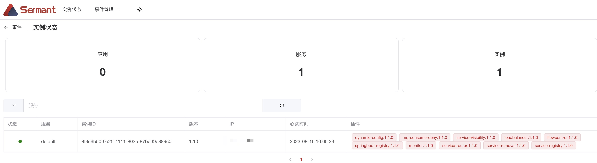

<div align="center">
<p></p><p></p>
<p>
    
</p>
<h1>基于JavaAgent的无代理服务网格解决方案</h1>


[简体中文](README.md) | [English](README-en.md)

[](https://gitter.im/SermantUsers/community?utm_source=badge&utm_medium=badge&utm_campaign=pr-badge)
[](https://www.apache.org/licenses/LICENSE-2.0.html)
[](https://github.com/huaweicloud/Sermant/actions?query=workflow:CI:push%20branch:develop)
[](https://codecov.io/gh/huaweicloud/Sermant)

</div>

## Sermant

**Sermant**（也称之为Java-mesh）是基于Java字节码增强技术的无代理服务网格，其利用Java字节码增强技术为宿主应用程序提供服务治理功能，以解决大规模微服务体系结构中的服务治理问题。

Sermant的愿景还包括构建插件开发生态系统，以帮助开发人员更容易地开发服务治理功能，同时不干扰业务代码。Sermant架构描述如下。


根据上图，Sermant中JavaAgent包含两层功能。

- 框架核心层。核心层提供Sermant的基本框架功能，以简化插件开发。该层的功能包括心跳、数据传输、动态配置等。
- 插件服务层。插件为宿主应用提供实际的治理服务。开发者可以直接利用框架核心服务开发简单插件，也可以开发插件自身的复杂服务治理功能来开发复杂插件。

Sermant中的JavaAgent广泛采用类隔离技术，以消除框架代码、插件代码和宿主应用程序代码之间的类加载冲突。

使用Sermant的微服务架构具有以下三个组件，如下图所示。


- Sermant JavaAgent：动态地为宿主应用程序提供服务治理能力。
- Sermant Backend：为JavaAgent的上传数据提供连接和预处理服务。
- Dynamic configuration center：通过动态更新监听的JavaAgent的配置来提供指令。Sermant项目不直接提供动态配置中心。这些项目目前支持servicecomb-kie等。

## 快速开始

下面是一个简单的演示，新用户只需4个步骤即可使用Sermant

### 准备工作

- [下载](https://github.com/huaweicloud/Sermant/releases/download/v1.2.1/sermant-1.2.1.tar.gz) Sermant包（当前版本推荐1.2.1）
- [下载](https://github.com/huaweicloud/Sermant-examples/tree/main/flowcontrol-demo/spring-cloud-demo/spring-provider) demo应用
- [下载](https://zookeeper.apache.org/releases#download) 并启动zookeeper

### 编译打包demo应用

在`${path}/Sermant-examples/flowcontrol-demo/spring-cloud-demo/spring-provider/`目录执行以下命令：

```shell
# windows linux mac
mvn clean package
```

打包成功后，在`${path}/Sermant-examples/flowcontrol-demo/spring-cloud-demo/spring-provider/target`得到`spring-provider.jar`

> 说明：path为demo应用下载所在路径

### 修改Sermant配置

修改`${path}/sermant-agent-x.x.x/agent/config/config.properties`文件中`agent.service.heartbeat.enable`和`agent.service.gateway.enable`配置为true，以此来开启Sermant的心跳服务和网关服务，如下所示：

```properties
agent.service.heartbeat.enable=true
agent.service.gateway.enable=true
```

> 说明：path为Sermant包下载所在路径

### 启动backend

在`${path}/sermant-agent-x.x.x/server/sermant`目录执行以下命令：

```shell
java -jar sermant-backend-x.x.x.jar
```

> 说明：path为Sermant包下载所在路径

### 启动demo应用

在`${path}/Sermant-examples/flowcontrol-demo/spring-cloud-demo/spring-provider/target`目录执行以下命令：

```shell
# linux mac
java -javaagent:${path}/sermant-agent-x.x.x/agent/sermant-agent.jar -jar spring-provider.jar

# windows
java -javaagent:${path}\sermant-agent-x.x.x\agent\sermant-agent.jar -jar spring-provider.jar
```

> 说明：path为Sermant包下载所在路径

### 验证

打开浏览器并导航到URL`http://localhost:8900`，如下图所示：




## 更多文档

请参阅 [Sermant文档](https://sermant.io/zh/document/)

## License

Sermant 采用 [Apache 2.0 License.](/LICENSE)

## 贡献指南

请阅读[贡献指南](https://sermant.io/zh/document/CONTRIBUTING.html)以了解如何贡献项目。

## 声明

- [Apache/Servicecomb-java-chassis](https://github.com/apache/servicecomb-java-chassis)：Sermant引用了Apache Servicecomb项目中的服务治理算法。
- [Apache/Servicecomb-kie](https://github.com/apache/servicecomb-kie): Sermant使用servicecomb-kie作为默认的动态配置中心。
- [Apache/SkyWalking](https://skywalking.apache.org/): 本项目中的插件架构参考了Apache Skywalking。Sermant中的部分框架代码是基于Apache Skywalking项目构建的。
- [Alibaba/Sentinel](https://github.com/alibaba/Sentinel): Sermant的流量控制插件是基于阿里巴巴Sentinel项目构建的。

## 联系我们

* [Gitter](https://gitter.im/SermantUsers/community)：Sermant社区的聊天室。
* 微信交流群：请先申请Sermant小二为好友，通过后会拉您进群，申请时请备注公司+职务，谢谢。


## 谁在使用Sermant

感谢各位用户和开发者对Sermant的关注和使用。

如果您已经在使用Sermant, 欢迎在 [Wanted: Who's using Sermant](https://github.com/huaweicloud/Sermant/issues/1396) 上填写用户信息来获取Sermant的开源落地技术支持。


华为云CPTS
华为云MAS
华为云CSE
