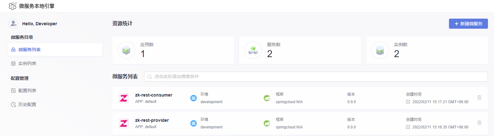

# 说明  
- 本文档提供了**Sermant**框架中:[注册插件](user-guide/register/document.md)在对应用无侵入的情况下，将注册到zookeeper的应用注册到ServiceComb上。

# 获取编译结果

## 下载release包
点击 [here](https://github.com/huaweicloud/Sermant/releases) 下载release包

## 源码编译
- 编译机器需具备git，java jdk，maven环境
- 执行`git clone -b develop https://github.com/huaweicloud/Sermant.git` 克隆最新源码
- 执行`cd Sermant`进入源码目录
- 执行`mvn clean package -Dmaven.test.skip -Pexample` 编译示例项目

# 启动
- 运行环境需要具备ServiceComb, zookeeper。**zookeeper以默认端口正常运行, 若需修改端口配置, 请参考[backend文档](user-guide/backend.md)修改配置**.
- 进入可执行文件根目录
- 执行以下命令启动backend，详细的后端模块介绍以及更多的配置修改，请参考[backend模块](user-guide/backend.md)
  ```bash
  # windows
  java -jar server\sermant\sermant-backend-x.x.x.jar
  
  # mac, linux
  java -jar server/sermant/sermant-backend-x.x.x.jar
  ```
- 执行以下命令启动注册插件provider示例应用
  ```bash
  # windows
  java -javaagent:agent\sermant-agent.jar -jar ..\sermant-plugins\sermant-example\demo-register\zk-resttemplate-provider\target\zk-resttemplate-provider.jar
  
  # mac linux
  java -javaagent:agent/sermant-agent.jar -jar ../sermant-plugins/sermant-example/demo-register/zk-resttemplate-provider/target/zk-resttemplate-provider.jar
  ```
- 执行以下命令启动注册插件consumer示例应用
  ```bash
  # windows
  java -javaagent:agent\sermant-agent.jar -jar ..\sermant-plugins\sermant-example\demo-register\zk-resttemplate-sonsumer\target\zk-resttemplate-consumer.jar
  
  # mac linux
  java -javaagent:agent/sermant-agent.jar -jar ../sermant-plugins/sermant-example/demo-register/zk-resttemplate-sonsumer/target/zk-resttemplate-consumer.jar
  ```
- 浏览器访问地址: http://localhost:8900 查看框架和启用插件的运行状态。

- 浏览器访问地址: http://localhost:30103 查看应用注册状态。

- 浏览器访问地址: http://localhost:8005/hello 验证provider和consumer订阅成功。


# 当前插件功能列表

|功能名称|子功能|状态|宿主的必要环境|支持的配置中心|
|:-:|:-:|:-:|:-|:-:|
|[限流降级](flowcontrol/flowcontrol.md)|接口限流<br>应用降级<br>隔离仓|稳定|SpringBoot 1.2.0.RELEASE - 2.6.x & SpringWebMvc 4.1.3.RELEASE - 5.3.x<br>ApacheDubbo 2.7.3 - 3.0.x<br>AlibabaDubbo 2.1.x - 2.6.x|Kie<br>ZooKeeper|
|[流量录制回放](flowrecord/document.md)||实验|||
|[全链路压测](hercules/document.md)|-|实验|-|-
|[影子库压测](online-stresstest/document.md)||实验|||
|[注册中心](register/document.md)|注册中心迁移<br>双注册中心|实验|SpringBoot 1.5.x, 2.0.0 - 2.6.2 & SpringCloud Edgware.x - 2021.0.0<br>- Eureka 1.4.x - 3.1.0<br>- Nacos 1.5.x - 2021.1<br>- Zookeeper 1.x.x - 3.1.0<br>- Consul 1.x.x - 3.1.0<br>ApacheDubbo 2.7.0 - 2.7.8, 2.7.11 - 2.7.15<br>- DubboRegistryZookeeper 2.7.0 - 2.7.8, 2.7.11 - 2.7.15<br>- DubboRegistryNacos  2.7.1 - 2.7.8, 2.7.11 - 2.7.15|Kie<br>ZooKeeper|
|[灰度发布](route/document.md)|-|实验|ApacheDubbo 2.7.5 - 2.7.8|Kie|
|[服务监控](server-monitor/document.md)|数据库连接池监控|实验|AlibabaDruid 1.0.x, 1.1.x, 1.2.0 - 1.2.8|-|
|[线程变量插件](threadlocal/document.md)||实验|||

## 相关文档

|文档名称|文档类型|
|---|---|
|[第三方版权说明手册](dev-guide/third_party_copyright.md)|开发手册|
|[版本管理手册](dev-guide/version_manage.md)|开发手册|
|[插件模块开发手册](dev-guide/dev_plugin_module.md)|开发手册|
|[插件代码开发手册](dev-guide/dev_plugin_code.md)|开发手册|
|[动态配置服务介绍](dev-guide/service_dynamicconfig.md)|开发手册|
|[心跳服务介绍](dev-guide/service_heartbeat.md)|开发手册|
|[网关服务介绍](dev-guide/service_send.md)|开发手册|
|[核心模块介绍](user-guide/agentcore.md)|使用手册|
|[入口模块介绍](user-guide/entrance.md)|使用手册|
|[后端模块介绍](user-guide/backend.md)|使用手册|