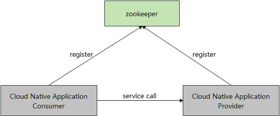
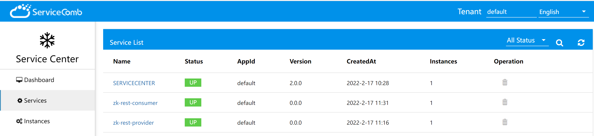
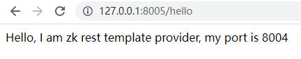

# 服务注册和发现 快速开始说明
本文档基于宿主应用更改注册中心的场景，我们将使用Sermant框架的注册插件，完整的展示了如何使用Sermant插件非侵入式地扩展宿主应用的功能。
另外，更新的插件功能请参见[插件列表](user-guide/feature-list.md)后自行选择。

## 使用Sermant前
如下图所示: 文档中演示使用的应用示例在未使用Sermant时, 会将应用注册到Zookeeper中。


## 使用Sermant后
如下图所示: 文档中演示使用的应用示例在使用Sermant时, Sermant会将原本注册到Zookeeper的应用信息注册到ServiceCenter中; Sermant采用zookeeper作为默认的配置中心，向插件提供了动态配置管理的能力。


# 获取编译结果

## 下载release包(当前暂无release版本)
点击 [here](https://github.com/huaweicloud/Sermant/releases) 下载release包

## 源码编译
- 编译机器需具备[git](https://git-scm.com/downloads) ,[jdk 8或11](https://www.oracle.com/java/technologies/downloads/) ,[maven](https://maven.apache.org/download.cgi) 环境
- 执行`git clone -b develop https://github.com/huaweicloud/Sermant.git` 克隆最新源码
- 执行`cd Sermant`进入源码目录
- 执行`mvn clean package -Dmaven.test.skip -Pexample` 编译示例项目

# 启动
- 运行环境需要具备[ServiceCenter](https://github.com/apache/servicecomb-service-center/releases) ,[zookeeper](https://zookeeper.apache.org/releases.html) 分别作为注册中心和配置中心。
- 进入编译后可执行文件根目录(例如:**sermant-agent-1.0.0**)
- 执行以下命令启动backend，详细的后端模块介绍以及更多的配置修改，请参考[backend模块](user-guide/backend.md)
  ```bash
  # windows
  java -jar server\sermant\sermant-backend-x.x.x.jar
  
  # mac, linux
  java -jar server/sermant/sermant-backend-x.x.x.jar
  ```
- 执行以下命令启动注册插件provider示例应用
  ```bash
  # windows
  java -javaagent:agent\sermant-agent.jar=appName=test -jar ..\sermant-plugins\sermant-example\demo-register\resttemplate-provider\target\resttemplate-provider.jar
  # mac linux
  java -javaagent:agent/sermant-agent.jar=appName=test -jar ../sermant-plugins/sermant-example/demo-register/resttemplate-provider/target/resttemplate-provider.jar
  ```
- 执行以下命令启动注册插件consumer示例应用
  ```bash
  # windows
  java -javaagent:agent\sermant-agent.jar=appName=test -jar ..\sermant-plugins\sermant-example\demo-register\resttemplate-consumer\target\resttemplate-consumer.jar
  # mac linux
  java -javaagent:agent/sermant-agent.jar=appName=test -jar ../sermant-plugins/sermant-example/demo-register/resttemplate-consumer/target/resttemplate-consumer.jar
  ```
- 点击[here](http://localhost:8900) 查看框架和启用插件的运行状态。

- 点击[here](http://localhost:30103) 查看应用注册状态。

- 点击[here](http://localhost:8005/hello) 验证provider和consumer注册和订阅成功。

  

## 相关文档

插件开发，请参考 [插件开发相关文档](https://github.com/huaweicloud/Sermant/blob/develop/docs/README.md#%E6%8F%92%E4%BB%B6%E5%BC%80%E5%8F%91)

