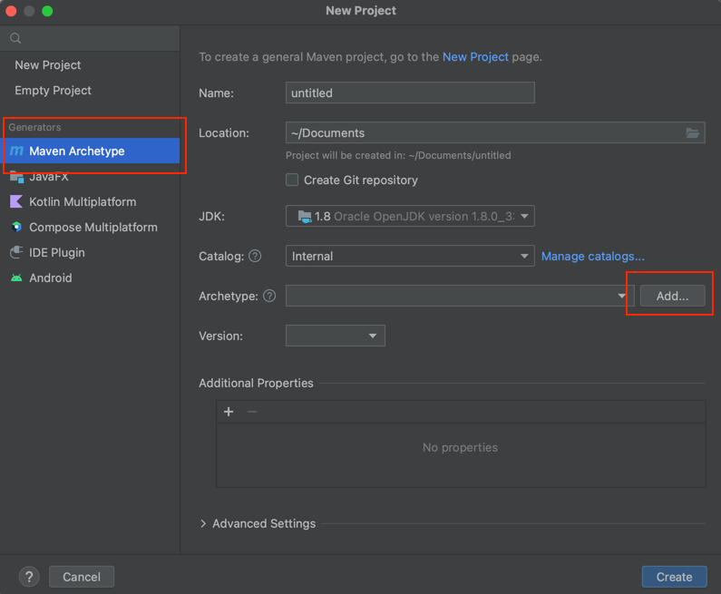
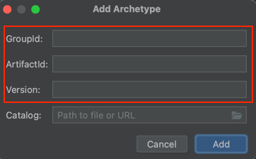
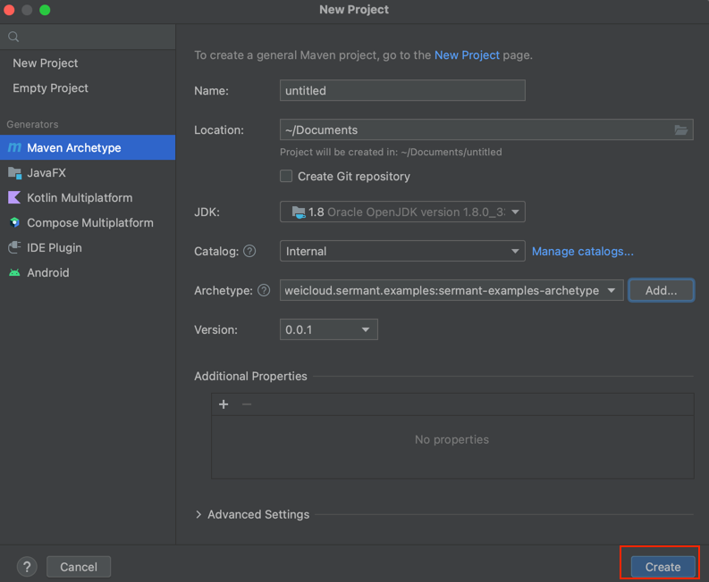
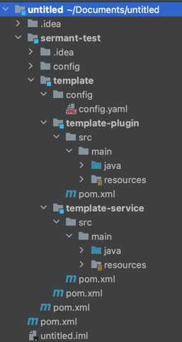

# Introduction To Sermant Plugin Development

[简体中文](dev_plugin_introduce-zh.md) | [English](dev_plugin_introduce.md)

## 1. ENV

- IDEA
- Maven3.*
- Java idk 8/11

## 2. Dev Sermant Plugin By Use Plugin Template

- IDEA New Project  
  

- Add Archetype  
  
  

```properties
GroupId:com.huaweicloud.sermant.examples
ArtifactId:sermant-examples-archetype
Version:0.0.1
```

- Create Project  
  

- Result  
  

## 3. Dev Sermant Plugin By Create Plugin Project

This section describes the configuration of the plugin development file no source,specific plugin development
reference [Plugin Module Development Guide](dev_plugin_module.md) and [Plugin Code Development Guide](dev_plugin_code.md).

### 3.1 IDEA Creates A Maven Project (The Project Created in This Document is Named **sermant-test**)

- Create a plugin module (this document creates in this document a plugin module named **template**)
- Create a plugin submodule in the plugin module (the submodule created in this document is named **
  template-plugin**)
- Create a service submodule in the plugin module (the submodule created in this document is named **
  template-service**)
- Create a config directory under the main project **sermant-test**
- Create a config directory under the plugin **template** module

### 3.2 Add The Following Files To The Config Directory Of The Main Project **sermant-test**

- [bootstrap.properties](https://github.com/huaweicloud/Sermant/blob/develop/sermant-agentcore/sermant-agentcore-config/config/bootstrap.properties) (startup configuration file, which specifies startup information for the Sermant instance)

```properties
appName=default
appType=0
instanceName=default
```

- [config.properties](https://github.com/huaweicloud/Sermant/blob/develop/sermant-agentcore/sermant-agentcore-config/config/config.properties) (core configuration file, this configuration is the core configuration set started by Sermant,
  specifying some operating mechanisms of Sermant and the running logic of services)

```properties
# agent config
agent.config.isEnhanceBootStrapEnable=false
agent.config.ignoredPrefixes=com.huawei.sermant,com.huaweicloud.sermant
agent.config.combineStrategy=ALL
agent.config.serviceBlackList=com.huaweicloud.sermant.implement.service.heartbeat.HeartbeatServiceImpl,com.huaweicloud.sermant.implement.service.send.NettyGatewayClient,com.huaweicloud.sermant.implement.service.tracing.TracingServiceImpl
agent.config.serviceInjectList=com.huawei.discovery.service.lb.filter.NopInstanceFilter,com.huawei.discovery.service.lb.DiscoveryManager

# adaptor config
adaptor.config.isLoadExtAgentEnable=false

# dynamic config
dynamic.config.timeoutValue=30000
dynamic.config.defaultGroup=sermant
dynamic.config.serverAddress=127.0.0.1:2181
dynamic.config.dynamicConfigType=ZOOKEEPER
dynamic.config.connectRetryTimes=5
dynamic.config.connectTimeout=1000
dynamic.config.userName=
dynamic.config.password=
dynamic.config.privateKey=
dynamic.config.enableAuth=false

# heartbeat config
heartbeat.interval=30000

#backend config
backend.nettyIp=127.0.0.1
backend.nettyPort=6888
backend.httpIp=127.0.0.1
backend.httpPort=8900

# service meta config
service.meta.application=default
service.meta.version=1.0.0
service.meta.project=default
service.meta.environment=
service.meta.zone=
```

- [plugins.yaml](https://github.com/huaweicloud/Sermant/blob/develop/sermant-agentcore/sermant-agentcore-config/config/plugins.yaml) (plugin configuration file, the configuration specifies the plugins and adapters loaded when Sermant
  starts, the name is the <package.plugin.name> configured in the pom when developing the plugin)

```yaml
plugins:
  - pluginName
```

- [logback.xml](https://github.com/huaweicloud/Sermant/blob/develop/sermant-agentcore/sermant-agentcore-config/config/logback.xml) (log configuration file, this configuration is the log configuration, which specifies the output rules of
  the log. The log dependency is shaded in the sermant-agentcore-core, so the Appender here cannot be modified, and the
  following configuration is required. operate)

```xml
<?xml version="1.0" encoding="UTF-8"?>

<configuration scan="true" debug="false">
    <!--  无操作事件监听器  -->
    <statusListener class="ch.qos.logback.core.status.NopStatusListener"/>

    <!-- 定义日志文件 输出位置 -->
    <property name="log.home_dir" value="${sermant_log_dir:-./logs/sermant/core}"/>
    <property name="log.app_name" value="${sermant_app_name:-sermant}"/>
    <!-- 日志最大的历史 30天 -->
    <property name="log.maxHistory" value="${sermant_log_max_history:-30}"/>
    <property name="log.level" value="${sermant_log_level:-info}"/>
    <property name="log.maxSize" value="${sermant_log_max_size:-5MB}" />
    <property name="log.totalSize" value="${sermant_log_total_size:-20GB}"/>

    <!-- 设置日志输出格式 -->
    <!-- %d{yyyy-MM-dd HH:mm:ss.SSS}日期-->
    <!-- %C类的完整名称-->
    <!-- %F文件名-->
    <!-- %M为method-->
    <!-- %L为行号-->
    <!-- %thread线程名称-->
    <!-- %m或者%msg为信息-->
    <!-- %n换行-->
    <property name="log.pattern" value="%d{yyyy-MM-dd HH:mm:ss.SSS} [%le] [%C] [%M:%L] [%thread] %m%n"/>

    <!-- ConsoleAppender 控制台输出日志 -->
    <appender name="CONSOLE" class="ch.qos.logback.core.ConsoleAppender">
        <filter class="ch.qos.logback.classic.filter.LevelFilter">
            <level>ERROR</level>
            <onMatch>ACCEPT</onMatch>
            <onMismatch>DENY</onMismatch>
        </filter>
        <encoder>
            <pattern>
                ${log.pattern}
            </pattern>
        </encoder>
    </appender>

    <!--设置一个向上传递的appender,所有级别的日志都会输出-->
    <appender name="app" class="ch.qos.logback.core.rolling.RollingFileAppender">
        <rollingPolicy class="ch.qos.logback.core.rolling.SizeAndTimeBasedRollingPolicy">
            <fileNamePattern>${log.home_dir}/app/%d{yyyy-MM-dd}/${log.app_name}-%i.log</fileNamePattern>
            <maxHistory>${log.maxHistory}</maxHistory>
            <MaxFileSize>${log.maxSize}</MaxFileSize>
            <totalSizeCap>${log.totalSize}</totalSizeCap>
            <cleanHistoryOnStart>true</cleanHistoryOnStart>
        </rollingPolicy>
        <encoder>
            <pattern>
                ${log.pattern}
            </pattern>
        </encoder>
    </appender>

    <root>
        <!-- 打印debug级别日志及以上级别日志 -->
        <level value="${log.level}"/>
        <appender-ref ref="app" />
    </root>

</configuration>
```

### 3.3 Add The Following Files To The Config Directory Under The Plugin **template** Module:

- config.yaml (plugin configuration file, according to the actual situation of the plugin, if there is a configuration
  file, it needs to be created, if there is no configuration, it does not need to be created)

### 3.4 Pom File Configuration

#### 3.4.1 Add The Following Content To The Pom File Of The Plugin Module (**template** In This Document) Project:

- The `<version>` field can change the version according to actual needs.
- The `<package.plugin.name>` field needs to modify the plugin name according to the actual situation.

```xml

<properties>
    <sermant.basedir>${pom.basedir}/..</sermant.basedir>
    <package.plugin.name>template</package.plugin.name>
    <shade.common.prefix>com.huaweicloud.sermant.dependencies</shade.common.prefix>
    <package.plugin.dir>${sermant.basedir}/agent/pluginPackage</package.plugin.dir>
    <package.plugin.type>undefined</package.plugin.type>
    <package.output.dir>${package.plugin.dir}/${package.plugin.name}/${package.plugin.type}</package.output.dir>
    <package.plugin.version>${project.version}</package.plugin.version>
    <config.source.dir>../config</config.source.dir>
    <config.output.dir>${package.plugin.dir}/${package.plugin.name}/config</config.output.dir>
    <maven.compiler.source>8</maven.compiler.source>
    <maven.compiler.target>8</maven.compiler.target>
</properties>
```

```xml

<build>
    <plugins>
        <plugin>
            <groupId>org.apache.maven.plugins</groupId>
            <artifactId>maven-resources-plugin</artifactId>
            <version>3.1.0</version>
            <inherited>false</inherited>
            <executions>
                <execution>
                    <phase>package</phase>
                    <goals>
                        <goal>copy-resources</goal>
                    </goals>
                    <configuration>
                        <outputDirectory>${sermant.basedir}/agent/config</outputDirectory>
                        <overwrite>true</overwrite>
                        <resources>
                            <resource>
                                <directory>${config.source.dir}</directory>
                                <includes>
                                    <include>bootstrap.properties</include>
                                    <include>config.properties</include>
                                    <include>logback.xml</include>
                                    <include>plugins.yaml</include>
                                </includes>
                            </resource>
                        </resources>
                    </configuration>
                </execution>
            </executions>
        </plugin>
        <plugin>
            <groupId>org.apache.maven.plugins</groupId>
            <artifactId>maven-clean-plugin</artifactId>
            <version>2.5</version>
            <inherited>false</inherited>
            <executions>
                <execution>
                    <id>agent-clean</id>
                    <phase>clean</phase>
                    <goals>
                        <goal>clean</goal>
                    </goals>
                    <configuration>
                        <filesets>
                            <fileset>
                                <directory>${sermant.basedir}/agent</directory>
                            </fileset>
                        </filesets>
                    </configuration>
                </execution>
            </executions>
        </plugin>
        <plugin>
            <groupId>org.apache.maven.plugins</groupId>
            <artifactId>maven-dependency-plugin</artifactId>
            <version>3.3.0</version>
            <inherited>false</inherited>
            <executions>
                <execution>
                    <id>copy</id>
                    <phase>package</phase>
                    <goals>
                        <goal>copy</goal>
                    </goals>
                </execution>
            </executions>
            <configuration>
                <artifactItems>
                    <artifactItem>
                        <groupId>com.huaweicloud.sermant</groupId>
                        <artifactId>sermant-agentcore-premain</artifactId>
                        <version>0.4.0</version>
                        <type>jar</type>
                        <overWrite>false</overWrite>
                        <outputDirectory>${sermant.basedir}/agent</outputDirectory>
                        <destFileName>sermant-agent.jar</destFileName>
                    </artifactItem>
                    <artifactItem>
                        <groupId>com.huaweicloud.sermant</groupId>
                        <artifactId>sermant-agentcore-core</artifactId>
                        <version>0.4.0</version>
                        <type>jar</type>
                        <overWrite>false</overWrite>
                        <outputDirectory>${sermant.basedir}/agent/core</outputDirectory>
                    </artifactItem>
                    <artifactItem>
                        <groupId>com.huaweicloud.sermant</groupId>
                        <artifactId>sermant-agentcore-implement</artifactId>
                        <version>0.7.0</version>
                        <type>jar</type>
                        <overWrite>false</overWrite>
                        <outputDirectory>${sermant.basedir}/agent/implement</outputDirectory>
                    </artifactItem>
                </artifactItems>
            </configuration>
        </plugin>
    </plugins>
    <pluginManagement>
        <plugins>
            <plugin>
                <groupId>org.apache.maven.plugins</groupId>
                <artifactId>maven-jar-plugin</artifactId>
                <configuration>
                    <archive>
                        <manifestEntries>
                            <Sermant-Plugin-Name>${package.plugin.name}</Sermant-Plugin-Name>
                            <Sermant-Plugin-Version>${package.plugin.version}</Sermant-Plugin-Version>
                        </manifestEntries>
                    </archive>
                </configuration>
            </plugin>
            <plugin>
                <groupId>org.apache.maven.plugins</groupId>
                <artifactId>maven-resources-plugin</artifactId>
                <executions>
                    <execution>
                        <phase>package</phase>
                        <goals>
                            <goal>copy-resources</goal>
                        </goals>
                        <configuration>
                            <outputDirectory>${config.output.dir}</outputDirectory>
                            <overwrite>true</overwrite>
                            <resources>
                                <resource>
                                    <directory>${config.source.dir}</directory>
                                    <includes>
                                        <include>config.yaml</include>
                                    </includes>
                                </resource>
                            </resources>
                        </configuration>
                    </execution>
                </executions>
            </plugin>
            <plugin>
                <groupId>org.apache.maven.plugins</groupId>
                <artifactId>maven-shade-plugin</artifactId>
                <executions>
                    <execution>
                        <phase>package</phase>
                        <goals>
                            <goal>shade</goal>
                        </goals>
                    </execution>
                </executions>
                <configuration>
                    <outputFile>${package.output.dir}/${project.artifactId}-${project.version}.jar</outputFile>
                    <relocations>
                        <relocation>
                            <pattern>net.bytebuddy</pattern>
                            <shadedPattern>${shade.common.prefix}.net.bytebuddy</shadedPattern>
                        </relocation>
                    </relocations>
                    <transformers>
                        <transformer
                                implementation="org.apache.maven.plugins.shade.resource.ServicesResourceTransformer"/>
                        <transformer
                                implementation="org.apache.maven.plugins.shade.resource.ApacheNoticeResourceTransformer"/>
                    </transformers>
                </configuration>
            </plugin>
        </plugins>
    </pluginManagement>
</build>
```

#### 3.4.2 Add The Following To The Pom File In The Submodule (template-plugin In This Document) Project:

- The `<package.plugin.name>` field needs to modify the plugin name according to the actual situation.

```xml

<properties>
    <sermant.basedir>${pom.basedir}/../..</sermant.basedir>
    <package.plugin.name>template</package.plugin.name>
    <package.plugin.type>plugin</package.plugin.type>
    <config.skip.flag>false</config.skip.flag>
</properties>
```

```xml

<build>
    <plugins>
        <plugin>
            <groupId>org.apache.maven.plugins</groupId>
            <artifactId>maven-shade-plugin</artifactId>
        </plugin>
    </plugins>
</build>
```

#### 3.4.3 Add The Following To The Pom File In The Submodule (template-plugin) Project:

- The `<package.plugin.name>` field needs to modify the plugin name according to the actual situation.

```xml

<properties>
    <sermant.basedir>${pom.basedir}/../..</sermant.basedir>
    <package.plugin.name>template</package.plugin.name>
    <package.plugin.type>service</package.plugin.type>
</properties>
```

```xml

<build>
    <plugins>
        <plugin>
            <groupId>org.apache.maven.plugins</groupId>
            <artifactId>maven-shade-plugin</artifactId>
        </plugin>
    </plugins>
</build>
```

#### 3.4.5 Package

- Execute `mvn clean package -DskipTests` under the parent project (sermant-plugin-template in this document)
- The agent directory appears in the parent project (sermant-plugin-template in this document), which is the final
  result.