# hercules

## 插件目录
[javamesh-hercules](../../../javamesh-plugins/javamesh-hercules)

## 插件定位

    全链路压测工具，提供集群高并发压测、性能数据分析和服务器监控等全面性能测试能力。

## 插件功能
* 压测脚本
  > 支持自定三种类型脚本：Python,Groovy,Maven Groovy
* 压测场景
  > 支持自定义三种压测场景：动态编排、引流压测和自定义脚本场景
  >> * 动态编排
  >> * 引流压测
  >> * 自定义脚本场景
* 快速开始
  > 一个页面直接开始执行压测任务，适合简单得压测任务执行
* 压测任务
  > 自定义功能复杂的压测任务明细
* 压测引擎
  > agent管理模块
* 监控分析
  > 被压测链路服务中，各节点服务器性能和jvm性能监控和分析
* 压测报告
  > 压测任务性能分析报告
## 插件使用方式
### 插件部署
#### web端部署方法
[hercules-adaptation 部署指导](../../../javamesh-plugins/javamesh-hercules/hercules-adaptation/README.md)
#### server端部署方法
[hercules-server 部署指导](../../../javamesh-plugins/javamesh-hercules/hercules-server/README.md)
#### agent部署方法
[hercules-agent 部署指导](../../../javamesh-plugins/javamesh-hercules/hercules-server/README.md)
#### monitor部署方法
[monitor 部署指导](../../user-guide/server-monitor/document.md)
### 使用指导
####登录
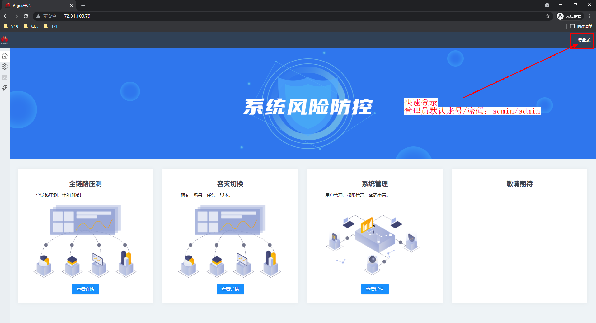
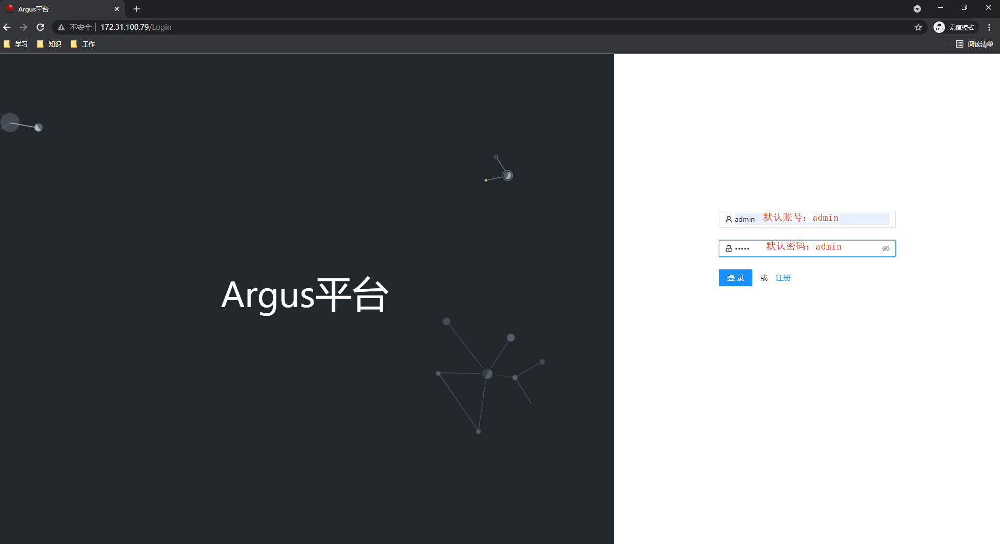
#### 全链路压测入口
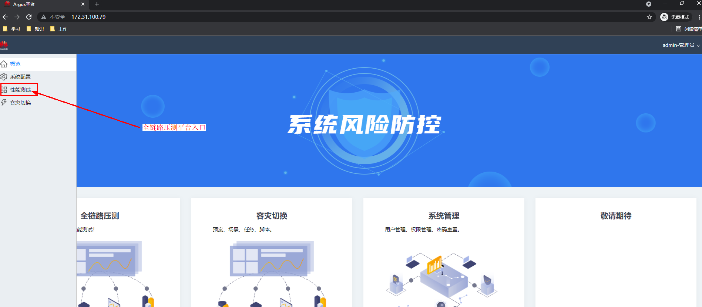
#### 创建脚本
创建脚本入口

创建脚本明细
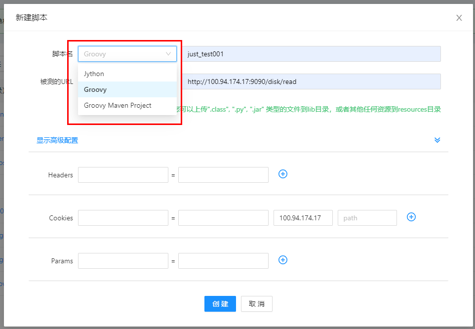
#### 创建场景
创建场景明细
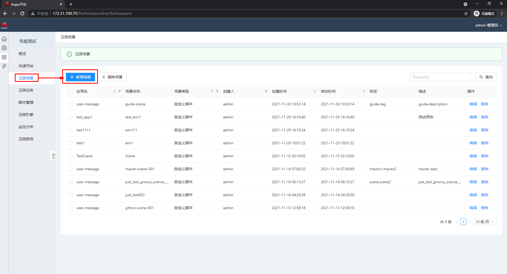
选择脚本
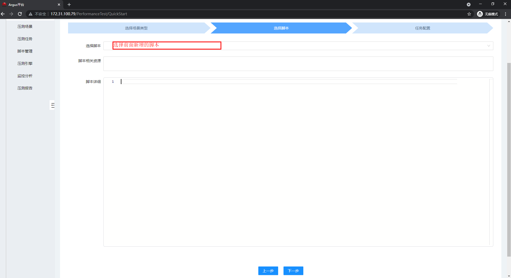
导入脚本之后能查看到脚本明细
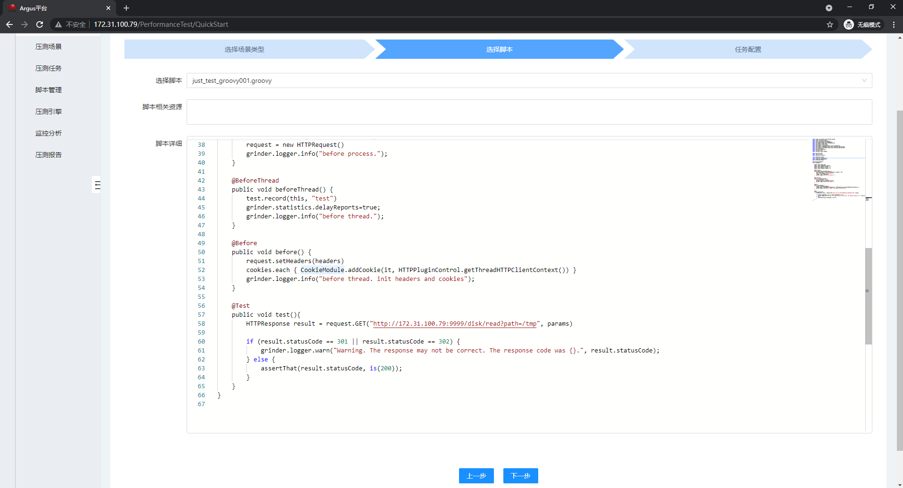
#### 创建压测任务
创建压测任务入口
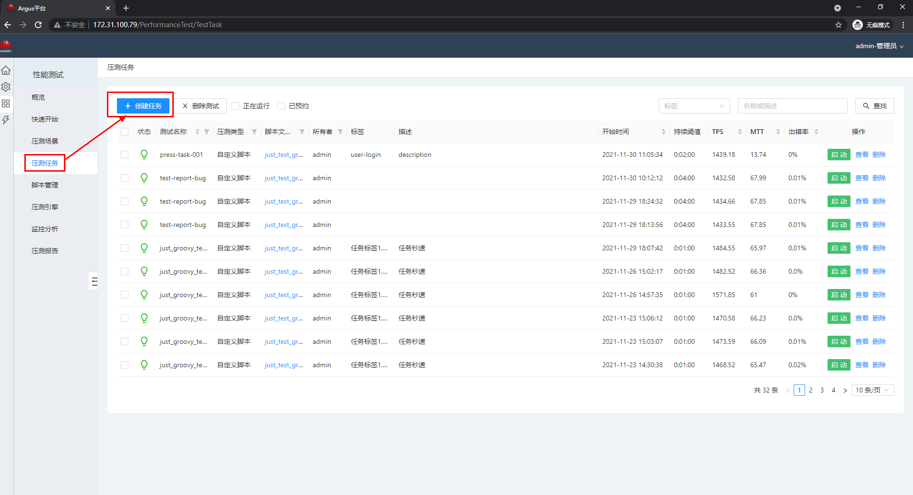
压测任务配置
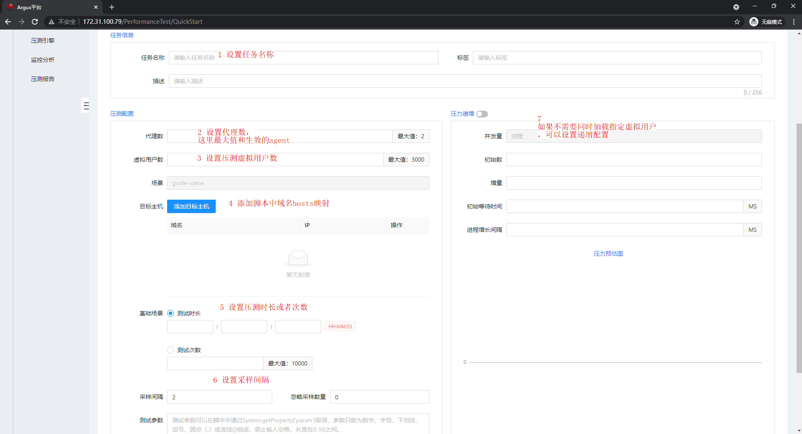
#### 启动压测任务
启动
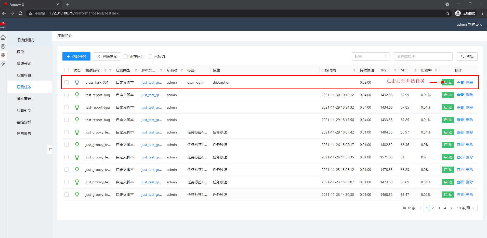
压测任务明细
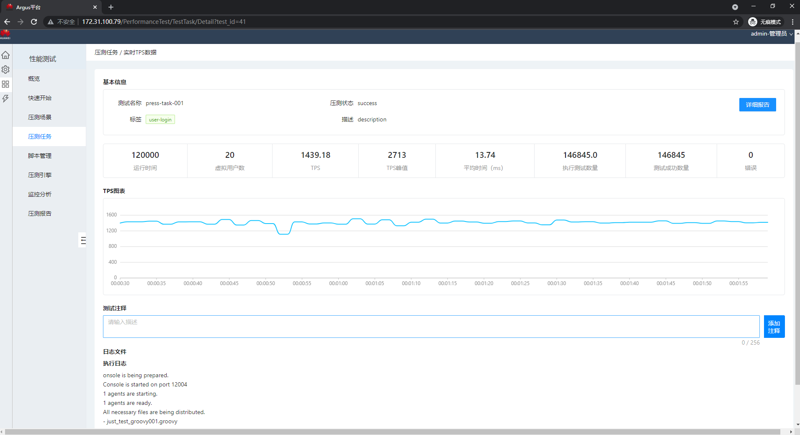
#### agent管理
agent管理页面
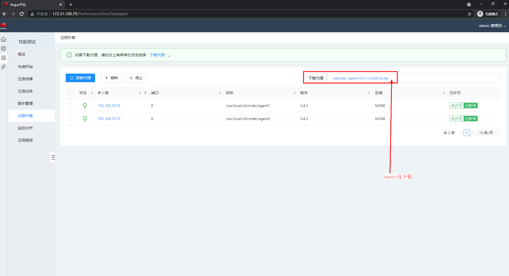
agent明细页面查询agent性能等信息
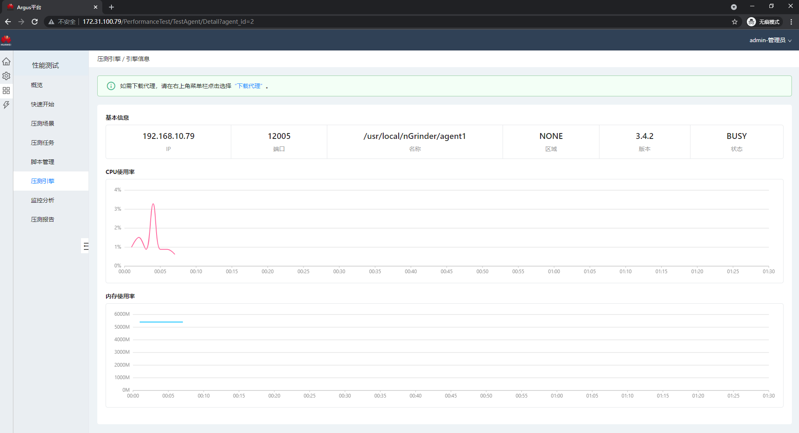
#### 监控分析
[分析模块待补充]()
#### 压测报告
压测报告菜单中查看每一个压测任务的测试报告

[返回**Java-mesh**说明文档](../../README.md)
