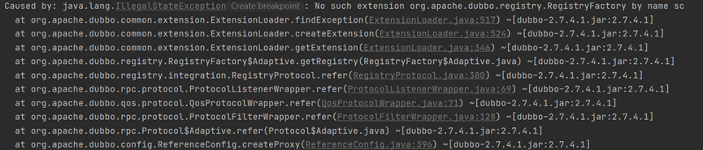
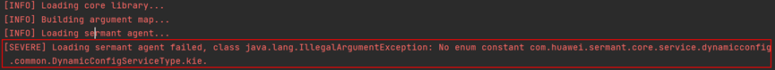
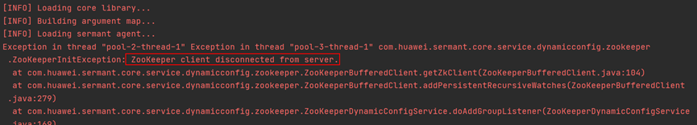
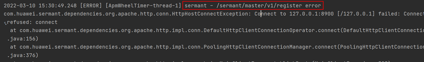
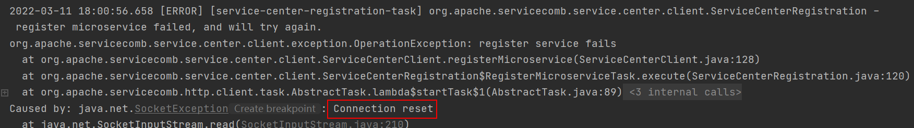
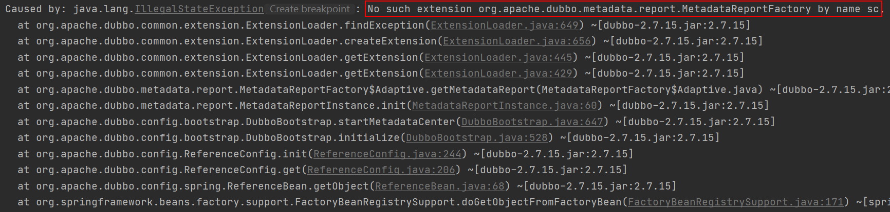
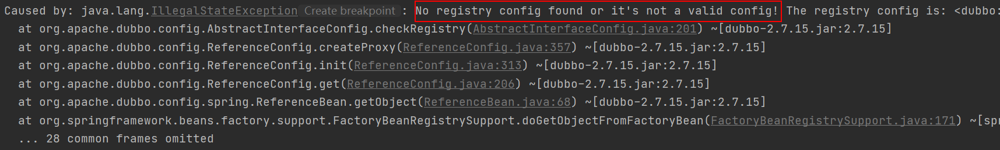

# 服务注册常见问题

[简体中文](FAQ-zh.md) | [English](FAQ.md)

本文主要介绍[服务注册插件](../../../sermant-plugins/sermant-service-registry)在使用时遇到的常见问题。

## 报错：No such extension org.apache.dubbo.registry.RegistryFactory by name sc

如下图所示：



该错误原因有以下3种：

1.1 宿主没有带agent启动。因为原生dubbo并不支持往sc注册，所以如果没带agent启动且配置的注册地址的协议为sc时，就会产生以上报错。

1.2 核心配置文件（${agent_package_path}/agent/config/config.properties）配置问题。仔细观察启动日志，会发现伴有类似以下的错误：



- 原因是核心配置文件中，配置中心类型（dynamic.config.dynamic_config_type）的值（需要为KIE/ZOOKEEPER）配置错误，从而导致宿主应用无法加载agent，最后导致No such extension org.apache.dubbo.registry.RegistryFactory by name sc的报错。

1.3 核心配置文件（${agent_package_path}/agent/config/config.properties）配置问题。仔细观察启动日志，会发现伴有类似以下错误：



- 原因是核心配置文件中，配置中心地址（dynamic.config.server_address）配置错误或者配置中心没有启动或者网络不通，从而导致宿主应用无法加载agent，最后导致No such extension org.apache.dubbo.registry.RegistryFactory by name sc的报错。

## 报错：/sermant/master/v1/register error

如下图所示：



原因是backend未启动或者配置地址不正确，请启动backend或正确配置地址。backend相关信息请见[backend文档](../backend-zh.md)。

注：该错误不会影响注册插件的流程，但会有相关报错。

## 报错：Connection reset

如下图所示：



请检查插件配置（${agent_package_path}/agent/pluginPackage/service-registry/config/config.yaml）中，注册中心地址（servicecomb.service.address）是否正确，协议是否正确（http/https）。

## 报错：https protocol is not supported

如下图所示：


需要在插件配置（${agent_package_path}/agent/pluginPackage/service-registry/config/config.yaml）中，开启ssl（servicecomb.service.sslEnabled）。

## 报错：No such extension org.apache.dubbo.metadata.report.MetadataReportFactory by name sc

如下图所示：



请检查dubbo应用的注册配置，protocol是否存在且不为sc，如下所示：

- 例如dubbo/provider.xml

```xml
<dubbo:registry address="sc://127.0.0.1:30100" protocol="nacos"/>
```

- 例如application.yml（或application.properties），以application.yml为例
```yml
dubbo:
  registry:
    protocol: nacos
    address: sc://127.0.0.1:30100
```

如果protocol存在且不为sc，请把protocol的值设置成sc，或者删除protocol配置。

## 报错：No registry config found or it's not a valid config

如下图所示：



需要设置dubbo本身注册中心地址的配置，请参考[服务注册插件文档](./document-zh.md#按需修改插件配置文件)中，关于**新开发**dubbo应用的说明。

## 插件配置中，enableSpringRegister/enableDubboRegister与openMigration之间的关系是什么？

enableSpringRegister/enableDubboRegister与openMigration之间的关系如下表所示：

|enableSpringRegister/enableDubboRegister|openMigration|作用|
|---|---|---|
|true|true|开启spring cloud/dubbo迁移功能|
|true|false|开启spring cloud/dubbo sc注册|
|false|true|关闭注册插件|
|false|false|关闭注册插件|


[返回**服务注册插件**说明文档](./document-zh.md)

[返回**Sermant**说明文档](../../README-zh.md)