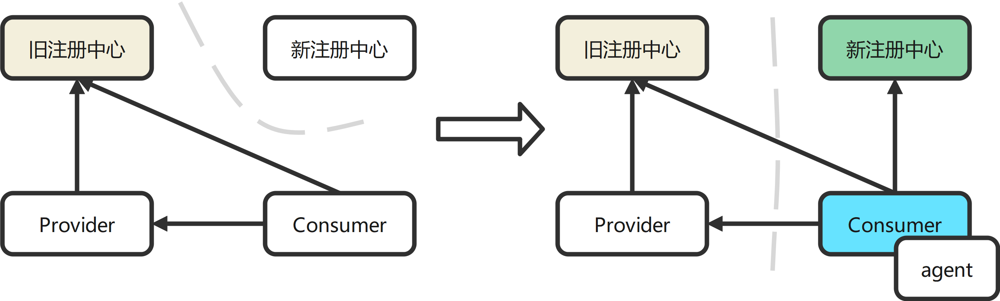

# Registry Migration - Spring Cloud

[简体中文](./spring-cloud-registry-migiration-zh.md) | [English](./spring-cloud-registry-migiration.md)

本文主要介绍[服务注册插件](../../../sermant-plugins/sermant-service-registry)基于Spring Cloud框架注册中心的迁移能力。

Dubbo迁移见[Dubbo注册中心迁移](dubbo-registry-migiration-zh.md)

## 功能

提供代码无侵入方式，基于双注册的模式让线上应用在线上业务不停机的前提下将注册中心快速迁移到[Service Center](https://github.com/apache/servicecomb-service-center)的能力。支持注册中心如下：

| 注册中心  | 是否支持 |
| --------- | -------- |
| Eureka    | ✅        |
| Consul    | ✅        |
| Nacos     | ✅        |
| Zookeeper | ✅        |

**支持版本**

| Spring Cloud Version | Spring Boot Version | Zookeeper Discovery Version | Nacos Discovery Version     | Consul Discovery Version     | Eureka Client Version                                 |
| -------------------- | ------------------- | --------------------------- | --------------------------- | ---------------------------- | ----------------------------------------------------- |
| Edgware.x            | 1.5.x               | 1.x.x, 2.0.x                | 1.5.x                       | 1.x.x,   2.0.x, 2.1.x        | 1.4.x, 2.0.x, 2.1.x                                   |
| Finchley.x           | 2.0.x, 2.1.x        | 2.x.x                       | 1.5.x, 2.0.x, 2.1.x         | 1.3.x, 2.0.x, 2.1.x          | 1.4.x, 2.0.x, 2.1.x                                   |
| Hoxton.x             | 2.2.x, 2.3.x        | 2.x.x, 3.0.0 - 3.1.0        | 2.x.x, 2020.0.RC1,   2021.1 | 1.3.x, 2.0.x, 2.1.x,   2.2.x | 1.4.4.RELEASE -   1.4.7.RELEASE, 2.x.x, 3.0.0 - 3.1.0 |
| 2020.0.x             | 2.4.x, 2.5.x        | 3.0.0 - 3.1.0               | 2.x.x, 2020.0.RC1,   2021.1 | 3.0.0   - 3.1.0              | 2.1.x, 2.2.x, 3.0.0 -   3.1.0                         |
| 2021.0.0             | 2.6.x               | 3.0.0 - 3.1.0               | 2.x.x, 2020.0.RC1, 2021.1   | 3.0.0   - 3.1.0              | 3.0.0 - 3.1.0                                         |

**搬迁示意图**



## 使用说明

### 修改[配置文件](../../../sermant-plugins/sermant-service-registry/config/config.yaml)

配置说明见[服务注册插件文档](./document-zh.md#按需修改插件配置文件)

基于以上配置，**新增迁移配置**，并开启Spring注册插件配置内容如下：

```yaml
servicecomb.service:
  openMigration: true #是否开启迁移功能 若进行注册中心迁移，则需将该值设置为true
  enableSpringRegister: true #开启spring注册插件
```

### 启动Service Center

Service Center启动流程详见[官网](https://github.com/apache/servicecomb-service-center)

### 进行双注册迁移模拟

（1）首先不带agent启动应用，例如有provider与consumer两个实例，启动后确保应用已成功注册到原注册中心且可正常访问

（2）启动一个新的provider，附加以下JVM参数，带agent一起启动

```shell
java -javaagent:${path}\sermant-agent-x.x.x\agent\sermant-agent.jar=appName=appName
```

其中path需要替换为Sermant实际打包路径，x.x.x需要替换为Sermant实际版本号，appName为agent的启动参数，与注册参数无关。

（3）启动成功后，新的provider实例会同时注册到Service Center与原注册中心，且consumer可以成功访问

（4）关闭旧的provider， 再按照（2）的方式启动新的consumer实例，同样确认新和旧的consumer都可以访问到provider，再停止旧的consumer即可

（5）最后再停止旧的注册中心

> ***提示：***
>
> *关闭原注册中心，由于大部分注册中心存在心跳检查机制，实例可能会不断刷错误日志，但不影响应用的正常调用。*
>
> *若需要停止此类错误日志，参考节[**注册中心心跳配置下发**](#**注册中心心跳配置下发**)*

## **注册中心心跳配置下发**

注册中心迁移插件提供基于动态配置中心下发关闭原注册中心心跳机制的方法，以避免源源不断的错误日志输出

**后台提供配置下发接口进行动态配置下发：**

URL

POST /publishConfig

**请求Body**

| 参数    | 是否必填 | 参数类型 | 描述      | 配置值                                  |
| ------- | -------- | -------- | --------- | --------------------------------------- |
| key     | 是       | String   | 配置的key | sermant.agent.registry                  |
| group   | 是       | String   | 配置的组  | service=YourServiceName                 |
| content | 是       | String   | 配置文本  | origin.\_\_registry\_\_.needClose: true |

若需要关闭请参考表格**配置值**列进行配置下发

> ***注意 :***
>
> *该操作为一次性操作，关闭注册中心心跳后，将无法开启，仅当应用实例重启才可恢复。*

[返回**服务注册插件**说明文档](./document-zh.md)

[返回**Sermant**说明文档](../../README-zh.md)