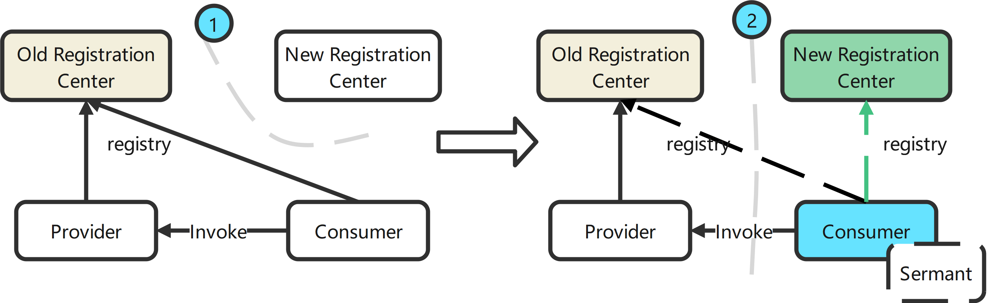

# Registry Migration - Spring Cloud

[简体中文](./spring-cloud-registry-migiration-zh.md) | [English](./spring-cloud-registry-migiration.md)

This document describes the migration capability of the [service registration plugin](../../../sermant-plugins/sermant-service-registry) based on the Spring Cloud framework registration center.

Dubbo migration  referring [Dubbo Registry Migration](dubbo-registry-migiration.md)

## Function

Provides the capability of quickly migrating the registration center to the [Service Center](https://github.com/apache/servicecomb-service-center) based on the dual-registration mode without interrupting online services business. The following registration centers are supported:

| Registration Center | Supported or Not |
| ------------------- | ---------------- |
| Eureka              | ✅                |
| Consul              | ✅                |
| Nacos               | ✅                |
| Zookeeper           | ✅                |

**Support Versions**

| Spring Cloud Version | Spring Boot Version | Zookeeper Discovery Version | Nacos Discovery Version     | Consul Discovery Version     | Eureka Client Version                                 |
| -------------------- | ------------------- | --------------------------- | --------------------------- | ---------------------------- | ----------------------------------------------------- |
| Edgware.x            | 1.5.x               | 1.x.x, 2.0.x                | 1.5.x                       | 1.x.x,   2.0.x, 2.1.x        | 1.4.x, 2.0.x, 2.1.x                                   |
| Finchley.x           | 2.0.x, 2.1.x        | 2.x.x                       | 1.5.x, 2.0.x, 2.1.x         | 1.3.x, 2.0.x, 2.1.x          | 1.4.x, 2.0.x, 2.1.x                                   |
| Hoxton.x             | 2.2.x, 2.3.x        | 2.x.x, 3.0.0 - 3.1.0        | 2.x.x, 2020.0.RC1,   2021.1 | 1.3.x, 2.0.x, 2.1.x,   2.2.x | 1.4.4.RELEASE -   1.4.7.RELEASE, 2.x.x, 3.0.0 - 3.1.0 |
| 2020.0.x             | 2.4.x, 2.5.x        | 3.0.0 - 3.1.0               | 2.x.x, 2020.0.RC1,   2021.1 | 3.0.0   - 3.1.0              | 2.1.x, 2.2.x, 3.0.0 -   3.1.0                         |
| 2021.0.0             | 2.6.x               | 3.0.0 - 3.1.0               | 2.x.x, 2020.0.RC1, 2021.1   | 3.0.0   - 3.1.0              | 3.0.0 - 3.1.0                                         |

**Schematic diagram of migration**



## Usage

#### Modify [Configuration File](../../../sermant-plugins/sermant-service-registry/config/config.yaml)

For details about the configuration, see the [service registration plugin document](./document.md#Modify-the-plugin-configuration-file-on-demand).

Based on the preceding configuration, **the migration configuration is added and the Spring registration plugin is enabled**. The configuration content is as follows:

```yaml
servicecomb.service:
  openMigration: true #Specifies whether to enable the migration function. To migrate the registration center, set this parameter to true.
  enableSpringRegister: true #Enabling the spring registration plugin
```

### Startup Service Center

For details about the Service Center startup process, see the [official website](https://github.com/apache/servicecomb-service-center).

### Registration Migration Simulation

（1）Start the application without the agent. For example, start separately one instance for provider and consumer, ensure that the application has been registered with the original registration center and can be requested normally.

（2）Start a new provider, add the following JVM parameters, and start the provider with the agent.

```shell
java -javaagent:${path}\sermant-agent-x.x.x\agent\sermant-agent.jar=appName=appName
```

**Replace path with the actual Sermant package path**, x.x.x is the actual Sermant version number, and appName with the agent startup parameter, which is irrelevant to registration parameters.

（3）After the service is started, the new provider instance will register to the service center and the original registration center both, and the consumer can request provider.

（4）Stop the old provider and start the new consumer instance in step 2. Ensure that both the old and new consumers can request the provider normally, then stop the old consumer.

（5）Finally, stop the old register center.

> ***Notices：***
>
> Stop the original register center. Because most of the registry centers have the heartbeat check mechanism, the instance may continuously update error logs, but the application invoking is not affected.
>
> To stop such error logs, see [**Delivering Heartbeat Configurations**](#Delivering-Heartbeat-Configurations).

## Delivering Heartbeat Configurations

The registration center migration plugin provides the method of disabling the heartbeat mechanism of the original registration center based on the dynamic configuration center to prevent continuous error log output.

**The [backend service](../backend.md) provides the configuration delivery interface for dynamic configuration delivery:**

URL

POST /publishConfig

**Request Body**

| Params  | Mandatory Or Not | Param Type | Description           | Configuration Value                     |
| ------- | ---------------- | ---------- | --------------------- | --------------------------------------- |
| key     | Y                | String     | configuration key     | sermant.agent.registry                  |
| group   | Y                | String     | configuration group   | service=YourServiceName                 |
| content | Y                | String     | configuration.content | origin.\_\_registry\_\_.needClose: true |

If you need to disable this function, deliver the configuration by referring to the Configuration Value column in the table.

> ***Notices :***
>
> This operation is a one-off operation. After the registration center heartbeat function is disabled, the heartbeat function cannot be enabled. It can be restored only after the application instance is restarted.

[Back to **Service Registration**](./document.md)

[Back to README of **Sermant** ](../../README.md)