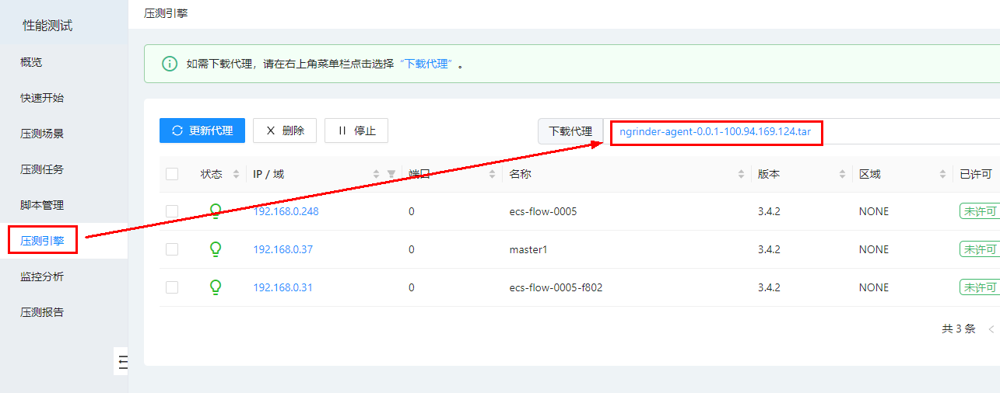

# Hercules-ngrinder
基于NGrinder3.4.3开发的后端服务项目，已去掉NGrinder原生前段页面代码
## 快速开始
### 一. 依赖环境
    （1）JDK1.8  
    （2）Tomcat8.5以上
    （3）MySQL8.0
### 二. NGrinder Controller部署
#### 1. 新增nGrinder的home目录
```
mkdir /usr/local/nGrinder/ngrinder
mkdir /usr/local/nGrinder/ngrinder_ex
```

#### 2. 设置nGrinder的环境变量
```
export NGRINDER_HOME=/usr/local/nGrinder/ngrinder
export NGRINDER_EX_HOME=/usr/local/nGrinder/ngrinder_ex
```

#### 3. 在/usr/local/nGrinder/ngrinder中新增配置文件database.conf
```
# H2 / cubrid / mysql can be set
database.type=mysql

# for cubrid. You should configure the following.
# database.url=localhost:33000:ngrinder

# for H2 remote connection, You should configure like followings.
# You can see how to run the H2 DB server by yourself in http://www.h2database.com/html/tutorial.html#using_server
# If this is not set, ngrinder will create the embedded DB.
# Specify database url
database.url=127.0.0.1:3306/hercules

# if you want to use HA mode in cubrid, you should enable following
# database.url_option=&althosts=secondary_ip:port

# you should provide id / password who has a enough permission to create tables in the given db.
database.username=root
database.password=123456
```

#### 4. 在项目最上层目录使用maven命令打包
```mvn clean package -Dmaven.test.skip=true```
> 待打包完成之后，把hercules-controller模块中的hercules-controller-0.0.1.war部署到tomcat即可。

### 三. 部署agent
#### 1. 在上面项目启动之后，压测引擎页面下载agent

#### 2. 上传agent的tar包到指定服务器之后解压，执行结果如下
```
[root@ecs-flow-0005 ngrinder-agent]# pwd
/opt/package/ngrinder-agent
[root@ecs-flow-0005 ngrinder-agent]# ll
total 496
-rw-r--r-- 1 root root    535 Oct 14 10:16 __agent.conf
drwxr-xr-x 2 root root   4096 Oct  8 11:26 lib
-rwxr-xr-x 1 root root    367 Aug 24 15:30 run_agent.bat
-rwxr-xr-x 1 root root     83 Aug 24 15:30 run_agent_bg.sh
-rwxr-xr-x 1 root root    237 Aug 24 15:30 run_agent_internal.bat
-rwxr-xr-x 1 root root     99 Aug 24 15:30 run_agent_internal.sh
-rwxr-xr-x 1 root root    312 Aug 24 15:30 run_agent.sh
-rw-r--r-- 1 root root 463149 Oct 28 20:06 run.log
-rwxr-xr-x 1 root root    135 Aug 24 15:30 stop_agent.bat
-rwxr-xr-x 1 root root    136 Aug 24 15:30 stop_agent.sh
[root@ecs-flow-0005 ngrinder-agent]#

```
#### 3. 进入agent解压目录之后使用命令启动
```
Usage: run_agent_bg.sh [options]
  Options:
    -ah, --agent-home
       this agent's unique home path. The default is ~/.ngrinder_agent
    -ch, --controller-host
       controller host or ip.
    -cp, --controller-port
       controller port.
    -hi, --host-id
       this agent's unique host id
    -o, --overwrite-config
       overwrite overwrite the existing .ngrinder_agent/agent.conf with the
       local __agent.conf
    -r, --region
       region
    -s, --silent
       silent mode
    -v, --version
       show version
    -help, -?, -h
       prints this message
```
#### 4. 当然也可以通过配置文件启动，修改agent当前目录中的__agent.conf文件，内容如下，然后使用[run_agent_bg.sh -o]启动
```
common.start_mode=agent
# controller ip
agent.controller_host=127.0.0.1

# controller port for agent
agent.controller_port=16001

# agent region
agent.region=NONE

#agent.host_id=
#agent.server_mode=true

# provide more agent java execution option if necessary.
#agent.java_opt=
# set following false if you want to use more than 1G Xmx memory per a agent process.
#agent.limit_xmx=true
# please uncomment the following option if you want to send all logs to the controller.
#agent.all_logs=true
# some jvm is not compatible with DNSJava. If so, set this false.
#agent.enable_local_dns=false
```

到此处，nGrinder controller和agent就部署完毕！
